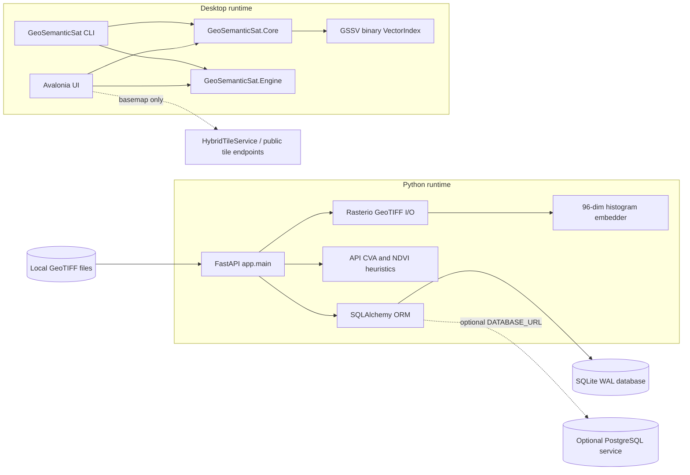

# Unified-RSanalytics Developer Guide

**Status:** Implementation-aligned documentation  
**Audience:** Backend, desktop, data, and operations developers  
**Repository:** Unified-RSanalytics / UpaGraha

## 1. Purpose and scope

Unified-RSanalytics is an Earth-observation analysis repository with two related
but independent runtimes:

1. A Python/FastAPI service for GeoTIFF ingestion, persistence, baseline visual
   similarity search, and API-level bi-temporal change analysis.
2. A .NET 10 desktop engine and Avalonia UI for local multi-spectral processing,
   semantic retrieval, change detection, clustering, review, and provenance.

The desktop application does **not** call the FastAPI service. It runs analysis
in-process through `GeoSemanticSat.Core` and `GeoSemanticSat.Engine`. The UI may
request basemap tiles through `HybridTileService`; this is separate from the
analytics pipeline and is not an air-gapped guarantee.

This guide describes code that exists in the repository. Declared dependencies,
planned features, benchmark targets, and generated sample artifacts are not
treated as implemented behavior unless the source confirms them.

## 2. Repository map

| Path | Responsibility |
| --- | --- |
| `app/` | FastAPI application, SQLAlchemy entities, settings, and baseline embedding service |
| `scripts/` | Database initialization, sample data creation, and FAISS index script |
| `tests/` | Python API tests |
| `Desktop_App/Upgrahan2/src/GeoSemanticSat.Core/` | Raster, spectral, change, clustering, vector index, and workflow primitives |
| `Desktop_App/Upgrahan2/src/GeoSemanticSat.Engine/` | Desktop embedding and retrieval orchestration |
| `Desktop_App/Upgrahan2/src/GeoSemanticSat.UI/` | Avalonia application, map canvas, tile service, and code-behind workflow |
| `Desktop_App/Upgrahan2/src/GeoSemanticSat.Cli/` | Headless commands for indexing, search, detection, and benchmarks |
| `Desktop_App/Upgrahan2/src/GeoSemanticSat.Tests/` | xUnit verification suite |
| `data/` | Host-mounted raster input for the backend |
| `models/` | Local model files; RemoteCLIP is not staged by default |
| `indexes/` | Backend/script-generated indexes and observation IDs |
| `documentation/` | Architecture, algorithms, sensor, API, desktop, and deployment references |

## 3. Runtime architecture



The two runtimes share domain concepts and raster files, but they do not share a
database session, HTTP client, or vector index at runtime.

## 4. Technology stack

### Backend

- Python 3.11 base image in `Dockerfile`
- FastAPI 0.115.6 and Uvicorn 0.34.0
- Pydantic Settings 2.7.1
- SQLAlchemy 2.0.36
- SQLite by default; optional PostgreSQL service in the `postgres` Compose profile
- Rasterio 1.4.3, Shapely 2.0.6, GeoPandas 1.0.1
- NumPy 2.2.1, pandas 2.2.3, Pillow 11.0.0
- FAISS CPU 1.9.0.post1 is declared for scripts, but API image search is a
  database-loaded linear scan
- pytest 8.3.4 and httpx 0.28.1 for backend tests

### Desktop

- .NET 10 (`net10.0`) and nullable reference types
- Avalonia 11.2.5 with Fluent theme and LucideAvalonia 1.6.2
- Microsoft.ML.OnnxRuntime 1.20.1 in `GeoSemanticSat.Engine`
- `System.Numerics.Vector<float>` for vector dot products
- xUnit 2.9.3 and Microsoft.NET.Test.Sdk 17.14.1 for tests

## 5. Implemented capability boundary

| Capability | Implemented path | Important limitation |
| --- | --- | --- |
| Backend GeoTIFF ingestion | `app.main.ingest_geotiff` | Reads at most three bands and downsamples to at most 256 by 256 for the baseline embedding |
| Backend image search | `app.main.search_by_image` | Loads stored JSON vectors and scans them in memory; it does not use FAISS |
| Backend text/hybrid search | `app.main.search_by_text` | Returns HTTP 503 until local RemoteCLIP weights and adapter are staged |
| Backend change analysis | `app.main.analyze_change` | Standardized-band CVA plus mean NDVI classification; no desktop masks, CUSUM, or jitter filter |
| Desktop change detection | `MultiTemporalChangeDetector` | Patch-level CVA with quality checks, indices, normalization, jitter suppression, and classes |
| Desktop semantic search | `SemanticSearchEngine` | Uses the 128-dimensional layout and a linear `VectorIndex` scan |
| FAISS index script | `scripts/build_index.py` | Separate script artifact; not connected to API request handling |
| Basemap display | `HybridTileService` | May use network tile endpoints; this is not an offline analytics dependency guarantee |

## 6. Standard workflows

### Backend development

Use the launcher from the repo root:

```bash
python dev.py backend
```

This starts Docker, waits for the healthcheck, initializes the schema, and seeds sample rasters.
The default database is `/app/dbdata/satintel.db` in the named `api_db` volume.
The `./data` bind mount is for rasters and must not be used for the SQLite file.

Manual equivalent (for reference, offline deployments, or troubleshooting):

```powershell
docker compose up -d --wait
docker compose exec -T api python scripts/init_db.py
docker compose exec -T api python scripts/create_sample_data.py
docker compose exec -T api pytest -v
```

### Desktop development

Use the launcher from the repo root:

```bash
python dev.py frontend
```

Or run directly:

```powershell
dotnet run --project "Desktop_App\Upgrahan2\src\GeoSemanticSat.UI\GeoSemanticSat.UI.csproj"
dotnet test "Desktop_App\Upgrahan2\src\GeoSemanticSat.Tests\GeoSemanticSat.Tests.csproj"
```

### CLI

```powershell
dotnet run --project "Desktop_App\Upgrahan2\src\GeoSemanticSat.Cli\GeoSemanticSat.Cli.csproj" -- index <input-directory> <output-index.bin>
dotnet run --project "Desktop_App\Upgrahan2\src\GeoSemanticSat.Cli\GeoSemanticSat.Cli.csproj" -- search <index.bin> "construction near water" 5
dotnet run --project "Desktop_App\Upgrahan2\src\GeoSemanticSat.Cli\GeoSemanticSat.Cli.csproj" -- detect <t1.tif> <t2.tif> <changes.geojson>
```

## 7. Documentation index

- [System architecture](01_system_architecture.md)
- [Algorithms and mathematics](02_algorithms_and_mathematics.md)
- [Sensors and raster processing](03_remote_sensing_and_sensors.md)
- [FastAPI reference](04_api_reference.md)
- [Desktop engine and CLI](05_desktop_engine_guide.md)
- [Deployment and security](06_deployment_and_security.md)
- [Implementation reference: algorithms, formulas, and persistence](07_implementation_reference.md)

## 8. Change discipline

When changing a vector encoder or `SemanticEmbeddingLayout`, rebuild every
persisted `.bin` index. Use `QualityMaskEngine.IsUsable(flags)` for quality
decisions, keep water detection MNDWI-gated, and use
`BoundingBox.AreaSquareMetres()` for area calculations. These are correctness
contracts, not merely implementation preferences.